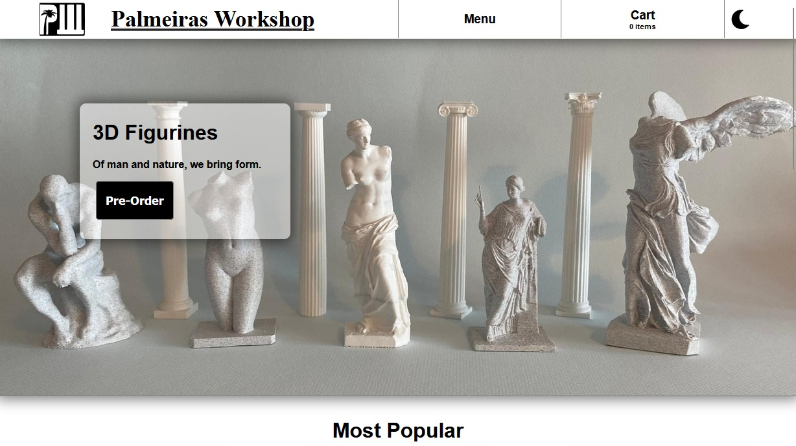

[Live website](https://dgloliveira.github.io/3D-Print-Shop/)

# Summary

This is a e-commerce website for a hypothetical store that sells 3D printed models exclusivelly online. The defining feature in this website is the ability of visualizing each model in 3D. Since this is an exclusivelly front end project for a hypothetical store, there is no back end or database, meaning that it does not make use of payment technologies or store data, and if it was a live store, it would send the buy order by email to the oficial store.

# About the models

The photos are taken by me using models I printed locally, with exception to two, all other models were aquired online for free and respect the Creative Commons licence they are filed under. Most models that can be seen in the website 3D view have been decimated, that is, their quality has been reduced in order to occupy less memory space and allow for faster response time on slower connections and still be accessible to lower end devices.

The exceptions is a model I made using Blender, and another model that has since ceased to exist online for unknown reasons. All models that are available online can be reached by using the link provided in the description of each individual model page, where the model is available for download, and the creator can be reached, thus fuffiling the Atribution section of the Creative Commons license.
